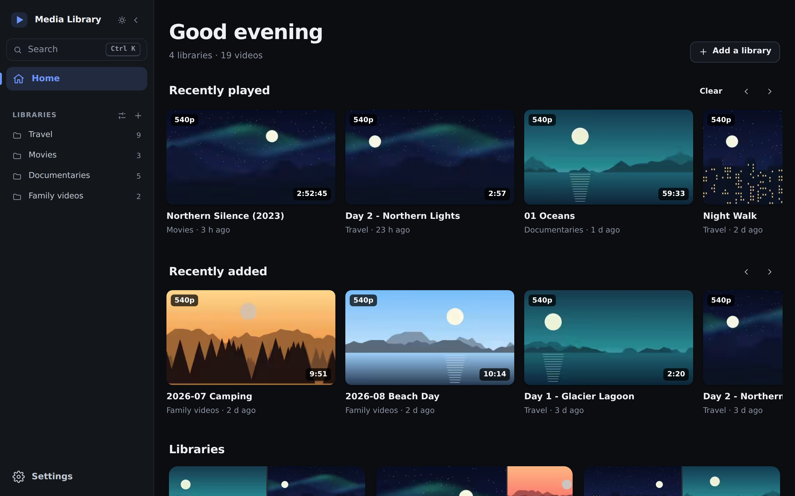
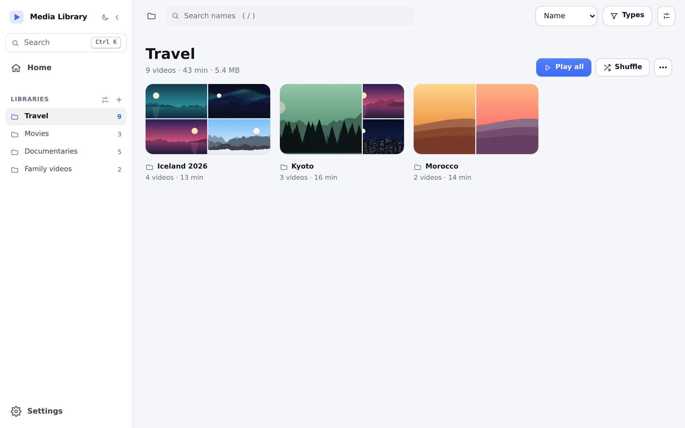
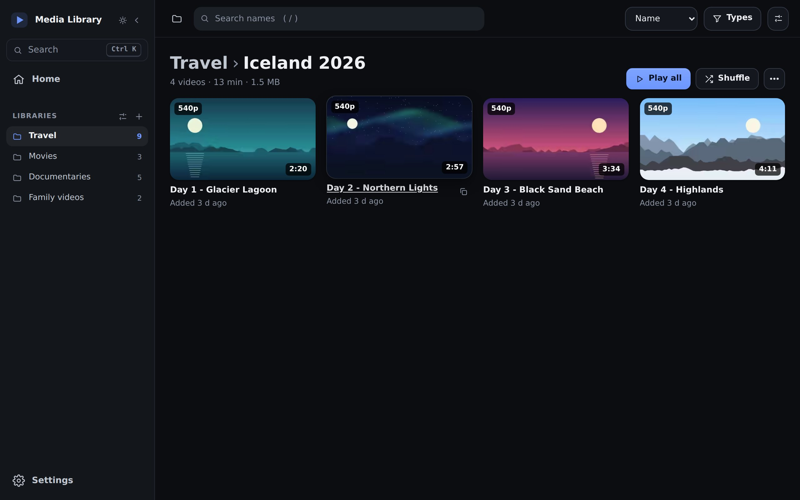
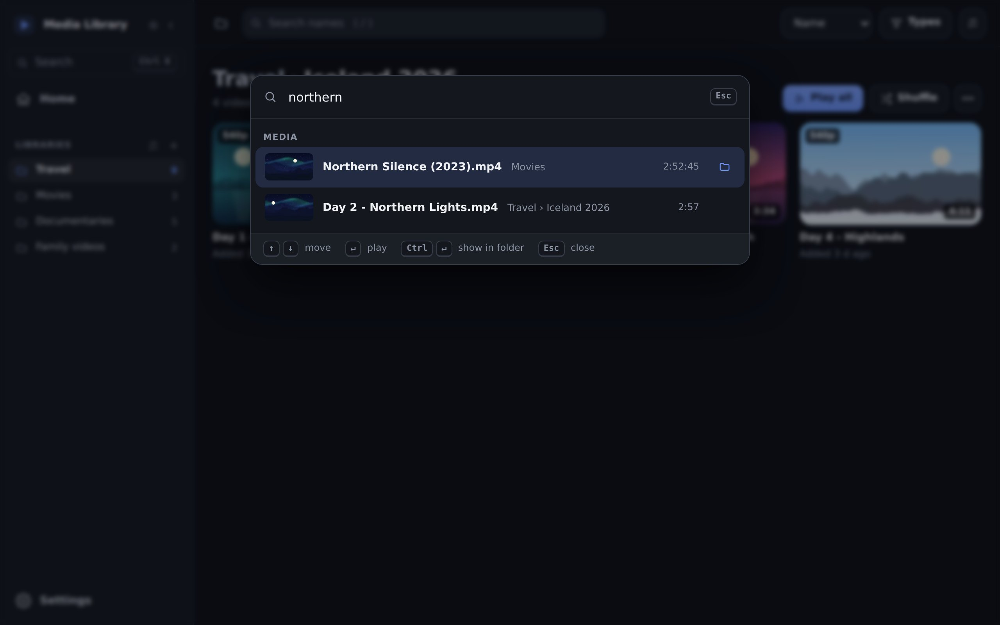
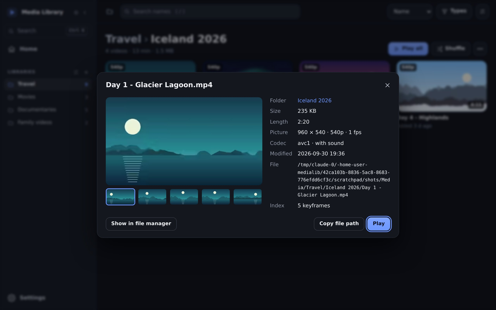
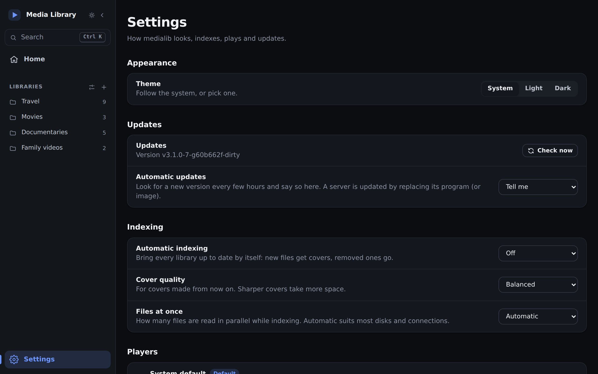
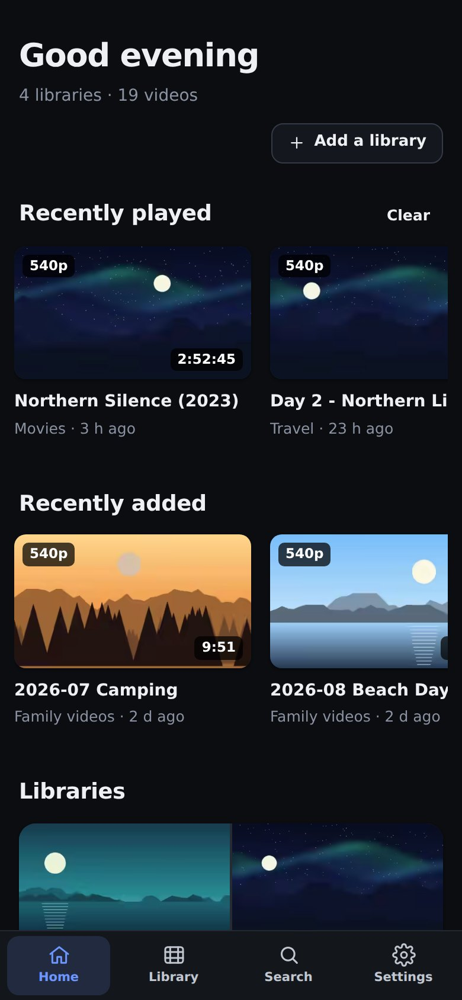

# Media Library

**Your video folders, as a wall of real covers. Click one, and it plays in the player you already use.**

Point it at a folder, a NAS share or an S3 bucket. Media Library finds every video, makes covers from real keyframes, finds anything as you type (in any language, pinyin and typos included), and opens it in mpv, VLC, PotPlayer, IINA or whatever you like. No account, no cloud, no transcoding: your files stay where they are.

<p align="center"></p>

**[Download for Windows](https://github.com/demogest/medialib/releases/latest)** (installer or portable) · **[macOS](https://github.com/demogest/medialib/releases/latest)** (Apple silicon) · **[Linux](https://github.com/demogest/medialib/releases/latest)** · or run it as a **server** ([Docker](#as-a-server)) and open it from any browser.

- **Set up in a minute.** The first run shows the folders on your computer that hold videos; one click adds one and makes its covers.
- **Browse like a streaming app.** Home shows what you played and what is new; folders are cards with their own covers; hover a video to scrub through its keyframes.
- **Find anything.** `Ctrl K` searches every library by name, folder, codec or resolution, with filters like `dur>1h` or `res>=4k`.
- **Your player, your files.** Plays in your own player, or copies the real path or link. It updates itself, and works the same on Windows, macOS and Linux.
- **Cloud storage too.** Browse and manage buckets on Amazon S3, Cloudflare R2, Backblaze B2, MinIO, RustFS and others, and make any bucket folder a library.

<table>
<tr>
<td width="50%"><br><sub>Folders as cards, light theme</sub></td>
<td width="50%"><br><sub>A folder: hover a cover to scrub its keyframes</sub></td>
</tr>
<tr>
<td><br><sub>Search every library at once</sub></td>
<td><br><sub>Every keyframe, codec, size and where the file is</sub></td>
</tr>
<tr>
<td><br><sub>Players, scanning, tools and updates, all in Settings</sub></td>
<td align="center"><br><sub>On a phone, from the server</sub></td>
</tr>
</table>

## Install

Take the file for your system from the [latest release](https://github.com/demogest/medialib/releases/latest):

| System | File | |
|---|---|---|
| Windows | `medialib-<version>-windows-x64-setup.exe` | Installer: per user, Start menu, can install ffmpeg for you |
| Windows | `medialib-<version>-windows-x64-portable.zip` | Portable: unzip and run `medialib.exe` |
| macOS (Apple silicon) | `medialib-<version>-macos-arm64.tar.gz` | |
| Linux | `medialib-<version>-linux-x64.tar.gz` | Needs GTK 3 and WebKitGTK 4.1 |
| A server | `medialib-<version>-<os>-<arch>-server.…`, or [Docker](#as-a-server) | No window; open it from any browser |

Covers are made with **ffmpeg** (and `ffprobe`), a free program: `winget install Gyan.FFmpeg` on Windows, `brew install ffmpeg` on macOS, `sudo apt install ffmpeg` on Debian and Ubuntu. medialib finds it on `PATH` and where Homebrew, winget, Scoop and Chocolatey put it, or set its place in Settings.

Every release lists its files and has a `SHA256SUMS` to check them against (`sha256sum -c SHA256SUMS`). Once installed, medialib keeps itself up to date (see [Updates](#updates)).

## Getting started

1. **Open it.** The first screen lists the folders on your computer that hold videos (Videos, Downloads, other disks). **Add** one, or **Choose a folder…**, or connect cloud storage.
2. **It scans the folder** and makes covers from real keyframes. New videos appear on Home as they are done.
3. **Click a cover** and it plays in your player. Choose which one in Settings → Players.

`Ctrl K` searches everything from anywhere, `Ctrl B` folds the sidebar, and `Alt 1`…`Alt 5` go to Home, Library, Storage, Activity and Settings.

## What's in it

**Home**: what you played lately and what is new in every library, one click from playing, and each library as a tile of its newest covers. *Recently added* means new to medialib: a file copied in with its old date kept still shows up there, and what arrived since your last visit is marked *New*. Until there is a library, it is the setup guide above.

**Library**
- Folders as cards with their own covers, or every video grouped by folder (*All videos*); a folder tree; sort by name, date, size or length. **Play all**, **Shuffle**, or save a folder as a playlist.
- A folder with its own picture (`poster.jpg`, `folder.jpg`, `cover.jpg` or `fanart.jpg`; also `.jpeg`, `.png` and `.webp`, as Kodi, Jellyfin and Plex name them) shows it as its card; other folders show a mosaic of their newest covers.
- **Pick several videos** with `Ctrl`-click (`⌘`-click on a Mac), `Shift`-click for a run of them, the check on a cover, or right-click → **Select**; `Ctrl A` picks everything shown and `Esc` lets go. The picks stay as you move between folders, and a bar plays them, shuffles them or makes a playlist of them.
- **⋯ → Find duplicates…** lists the files that have copies of the same size and length anywhere in the library, and how much space the extra copies take. Nothing is deleted: open the folder (or Storage, for a bucket) to remove the ones you don't need.
- Five real keyframes per video; hover a cover to scrub through them. medialib reads an MP4's own sample index and fetches only the bytes of the chosen keyframes (about 1 to 4 MB per video, even over the network). H.264, HEVC and AV1; other formats fall back to ffmpeg. Scans are incremental and use every core.
- A library can be a local folder, a NAS share, or a folder in a bucket, read straight through the S3 API.
- Plays in mpv, mpv.net, VLC, PotPlayer, MPC-HC, MPC-BE, IINA, SMPlayer, Celluloid, Haruna or the system default, whichever are installed, or any other you add in Settings.
- Subtitle files named after a video (`Film.srt`, `Film.en.ass`, `Film.zh.vtt` next to `Film.mkv`) show as **CC** on its cover. A player opening a video from a bucket gets them too: medialib copies them to this computer and hands them over (mpv, mpv.net, IINA, MPC-HC and MPC-BE take all of them; VLC, PotPlayer and SMPlayer the first). From a folder, players find them by themselves.
- **Copy link** gives the file's real location: its path on this computer for a local library, a link that works anywhere for a week for a bucket. **Save as playlist…** writes an `.m3u8` of the same links, which any player opens without medialib.
- Click a file's name (or right-click → **Details**) for all its keyframes (arrow keys step through them), codec, frame rate, sound and full path. **Show in Explorer** (Finder, or the file manager on Linux) opens its folder with the file selected.

**Search** (the box in a library, and `Ctrl K` for every library at once)
- By name, folder, extension, codec or resolution (`hevc`, `4k`, `1080p`). Several words must all match.
- Chinese, Japanese and any other script. Chinese by **pinyin**, full (`donghua`) or initials (`dh`); hiragana and katakana alike.
- Fuzzy: letters in order (`hldy`) and a slip of the keys (`holidya`) still find the file.
- **Filters** narrow the results, or list files on their own: `dur>1h`, `dur<20m` (a bare number is minutes), `size<2g`, `size>500mb` (a bare number is megabytes), `date>=2024-05`, `date=2024`, `res>=1080`, `res>=4k`, with `<`, `<=`, `>`, `>=` or `=`.
- Files are searchable as soon as they are listed, before their covers are made. Results are ranked by relevance; in `Ctrl K`, `Enter` plays and `Ctrl Enter` shows the file in its folder.
- The star in a library's search box saves the search (`dur>1h res>=4k`, say) as a chip above the covers, one click to run again in any library. Saved searches belong to the browser they were saved in.

**Storage** (once a store is connected)
- Connect to **RustFS, MinIO, Amazon S3, Cloudflare R2, Backblaze B2, Wasabi, Alibaba OSS, Tencent COS, DigitalOcean Spaces, Google Cloud Storage** (interoperability mode) or anything else that speaks S3. Presets, a connection test, and one-click import of the credentials you already have: rclone remotes, `~/.aws` profiles and `AWS_*` variables.
- Browse buckets and folders as a list or a grid, with filter and recursive search, sortable columns, multi-select and keyboard shortcuts.
- Preview images, video, audio and text in place; see and edit content type, `Cache-Control` and custom metadata.
- Upload files and whole folders (large files go up in parallel parts, with progress). Download, rename, copy and move between folders, buckets and even connections; delete folders with everything in them.
- Copy links that expire (1 hour, 24 hours, 7 days), `s3://` addresses or object keys. Create and delete buckets, measure folder sizes, clean up unfinished uploads, and make any folder a library with one click.
- Secrets stay on your computer, in `config.json` or in an environment variable you name, and are never sent to the browser.

**Activity**: scans, copies, moves, deletes and size scans, with progress, cancel and a list of what failed. A chip in the sidebar shows while anything runs.

**Settings**: theme; automatic scanning, cover quality and files at once; the players (add one, remove one, pick the default, look again); your own ffmpeg, ffprobe or rclone; where the index and covers live (moved for you, with progress); cloud storage; updates.

### Updates

medialib looks for a new release every few hours and says so in the sidebar and under Settings → About. **What's new** shows the release notes of every version since yours, newest first; it opens by itself when **Check now** finds one. The desktop app installs it with **Update now**, or by itself as it closes with *Install automatically*. A download is used only if it matches the release's `SHA256SUMS`; a Windows install runs the new setup and comes back, a portable copy replaces its own program. A server only tells you: replace its program or image. Settings → About → Automatic updates → *Off* (`"updates": "off"`) never asks GitHub. Alpha and beta versions are never offered.

## Two ways to run it

One program, one interface: the **desktop app** in its own window, or a **server** you open from any browser. The page is the same either way, served from inside the program.

### Desktop app

```bash
medialib desktop              # or double-click it
```

The interface in its own window, with a server that lives and dies with the window. Settings and indexes live in your user config folder (`%AppData%\medialib`, `~/.config/medialib`).

On **Windows** it is a proper application: one window per user (starting it again brings the running one forward), the window comes back where you left it, the title bar follows the light or dark theme, and links to other sites open in your browser. It uses the WebView2 runtime that comes with Windows 11, or else an Edge or Chrome app window. macOS and Linux use the system's web view.

### As a server

```bash
medialib serve                                   # http://127.0.0.1:8766, this computer only
medialib serve --host 0.0.0.0 --port 8766        # reachable by other computers
```

or in a container: `docker compose up -d` (see [`docker-compose.yml`](docker-compose.yml); the image is ffmpeg plus the one program).

- Set **`MEDIALIB_PASSWORD`** (or `"password"` in `config.json`) before opening the server to other computers. Every request then needs it (HTTP Basic, any user name). Without a password, other computers can browse libraries and watch, but cannot touch storage, connections or anything that changes.
- Serve it over HTTPS, for example behind Caddy or nginx: the password is sent with every request.
- Playing in an external player and the folder picker act on the computer running the server, so they are for a browser on that computer. From another computer or a phone a cover plays in the browser when the browser can play that file. When it cannot (MKV, HEVC and the like), medialib offers **Open in VLC** or **Open in Infuse** on an iPhone or iPad, **Open in VLC** or another app on Android, and a playlist to download elsewhere. **Copy playlist link** hands a whole folder to your own player.
- New files show up after the next scan. Set **`MEDIALIB_AUTO_INDEX`** (or `"auto_index"`) to a number of minutes and the server scans every library by itself: soon after it starts, then that long after each pass. A library that cannot be reached at the time (a disk that is not plugged in) is skipped, not marked as failed. Without a server running, `medialib index --all` from cron or a scheduled task does the same once.
- A scan does the newest files first. A file ffmpeg cannot read is listed under **N files could not be scanned → See which**, with the reason; scans leave it alone until the file changes or ffmpeg is updated. **Try again** there (or `medialib index --retry`) tries those files once more.
- `MEDIALIB_HOST`, `MEDIALIB_PORT`, `MEDIALIB_HOME` and `MEDIALIB_LOG=1` (a log line per request) are read from the environment, which is how the container is configured. `GET /healthz` answers `ok` without a password.

### Command line

```bash
medialib add "D:\Videos" --name "My videos"            # a local folder or NAS share
medialib import                                        # credentials found on this computer
medialib import rclone:myremote                        # adopt one
medialib connect --provider minio --endpoint http://nas:9000 \
       --access-key KEY --secret-env MY_SECRET_VARIABLE          # prefer --secret-env to --secret-key
medialib connections --test
medialib ls nas                                        # buckets
medialib ls nas:media/videos/ -r                       # objects
medialib add-s3 nas media/videos --name "NAS videos"   # a bucket folder as a library
medialib index --library nas-videos
medialib index --all                                   # every library, one after another (for cron)
medialib compact                                       # convert older covers to the current format
```

`medialib help` lists them all.

A library set up through rclone keeps working. **Manage libraries → ⋯ → Read directly over S3** switches it to the S3 API without scanning again, and takes rclone out of every request.

## Configuration

`config.json` and the `cache/` folder (indexes, covers) live in the first of these that applies: `$MEDIALIB_HOME`; the working directory or the program's folder, if a `config.json` is there (portable use); your user config folder. See [`config.example.json`](config.example.json). Settings changes it for you; the file is written readable by you only, and keys medialib does not know are kept.

| Key | Meaning |
|---|---|
| `connections` | `{"id", "name", "provider", "endpoint", "region", "access_key", "secret_key" or "secret_key_env", "addressing": "path"/"virtual"/"auto", "verify_tls", "default_bucket"}`. `default_bucket` is for keys limited to one bucket, which cannot list the others. |
| `libraries` | `{"type": "local", "path"}`, `{"type": "s3", "connection", "bucket", "prefix"}`, or the older `{"type": "rclone", "remote", "bucket", "prefix"}` |
| `players` | Players added by hand (Settings → Players → Add a player), listed before the detected ones; one with the id of a detected player takes its place. `title_arg` passes the file name as the window title; `args` is a list of extra arguments for every launch (for mpv, `["--demuxer-max-bytes=256MiB"]` keeps its read-ahead small). |
| `hidden_players` | Ids of detected players removed from the list (Settings brings them back). |
| `default_player` | Player used until you pick one |
| `rclone`, `ffmpeg`, `ffprobe` | Where these programs are, if medialib does not find them by itself |
| `cache_dir` | Where indexes and covers live, if not in `cache/` beside `config.json`. Change it in Settings, which moves them. |
| `updates` | `"off"`, `"notify"` (the default: say when there is a new version) or `"auto"` (the desktop app installs it as it closes) |
| `workers` | Files scanned at once. The default depends on the CPU count and the library type. |
| `thumb_quality` | Quality (1 to 100) of new covers: AVIF when ffmpeg can write it, else WebP. Default 65; lower is smaller. |
| `auto_index` | Minutes between automatic scans of every library while medialib runs. Default 0 (off); `MEDIALIB_AUTO_INDEX` takes precedence. |
| `password` | Password for a server other computers can reach; `MEDIALIB_PASSWORD` takes precedence. |

## Security

- The server listens on `127.0.0.1` only unless you say otherwise, and refuses cross-site requests and foreign `Host` names.
- Everything that changes anything, and everything that touches your object stores (browsing included), is accepted only from the computer running medialib, even with `--host 0.0.0.0`, unless a password is set and the request carries it. A request that arrives through a reverse proxy never counts as local. Changes also need a header that web pages on other sites cannot send.
- Files from a bucket or a folder are served sandboxed: an HTML or SVG file opened in a tab never runs as part of medialib. No page of medialib can be framed by another site. A browser that may only watch is not told local paths.
- Credentials live in `config.json`: anyone who can read that file can use your store, so keep it out of backups you share, or use `secret_key_env`.

Found a security problem? Please report it privately, as [SECURITY.md](SECURITY.md) explains, not in a public issue.

## Contributing

Found a bug or have an idea? [Open an issue](https://github.com/demogest/medialib/issues/new/choose): there is a short form for each. Building from source, the code's layout, tests, conventions and how releases are made: [CONTRIBUTING.md](CONTRIBUTING.md). Who the app is for and how its interface decides things: [docs/DESIGN.md](docs/DESIGN.md). Coding agents: [AGENTS.md](AGENTS.md).

## License

[MIT](LICENSE).
